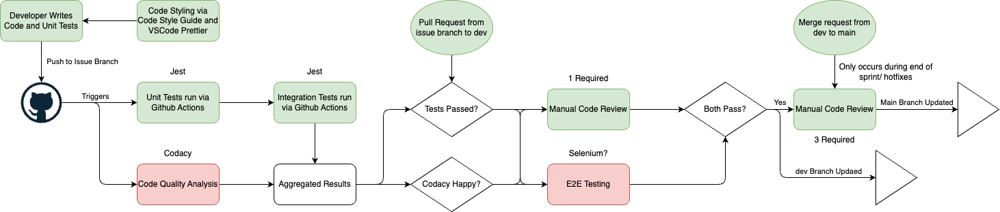

# CI/CD Pipeline
Given the scope of our project, we have chosen to omit/include certain things in our pipeline. 
This will serve as an overview as to the entire process, from end-to-end. 
However, this pipeline is currently in the process of being implemented, and is currently at a stage where the essential items have been finished in order for developers to be able to write code.

## Table of Contents
- [Overall Workflow](#overall-workflow)
- [Linting and Code Style](#linting-and-code-style)
- [Code Quality](#code-quality)
- [Code Review](#code-review)
- [Unit Testing](#unit-testing)
- [Integration Testing](#integration-testing)
- [End-to-End Testing](#end-to-end-testing)

## Overall Workflow
The overall flow follows as such:

wherein the color of the box indicates it's current implementation status: green being finished, red being planned/ in progress.

### Pull Request Structure
Currently our overall git workflow/structure is as follows (without any of the below interventions)
1. Create branch off of `dev` pertaining to issue-id, and link to issue 
2. Do work on this branch for specific issue
3. Push to branch once work is finished
4. Create a Pull Request from `issue-branch` into `dev`
At this point a manual review of the code is required by at least one other team member.

Upon the conclusion of a sprint, a merge will be done from `dev` into `main`, which then requires 3 seperate code reviewers before the merge is allowed. 

### Linting and Code Style
For all developers, we have a code style guide to adhere to, which can be found in [Code Style Guide](../code-style.md).
Notable callouts that may pertain to CI/CD include:
- Documentation creation and styling for functions
- Use of `prettier with VSCode` extension
- Specific naming and usage conventions.
In using these, we keep code consistent and moe readable, which will help us later in both creating/updating documentation, as well as during any manual code review processes.


On a push to any issue branch, two things then occur:
### Code Quality
For code analysis beyond a basic static analysis level, we use `Codacy`, which does static analysis, but uses AI and other nice features to enhance and accelerate the process.
Doing this would make our codebase more consistent and secure.
We do this by connecting our github repo to `Codacy` itself. 
Codacy then check how well-written the code is, and offers feedback and a go/no-go approach to a pull request.

### Unit Testing
Unit tests are run using github actions which trigger on a `push`, with the underlying test framework being reliant on `jest`.
Specifically, we will house unit tests in the folder given `test/unit/*`, which we can call using 
```json
"unittest": "node --experimental-vm-modules node_modules/jest/bin/jest.js tests/unit/"
```
in the scripts section of the package.json

and then we have a specific github action to run some npm stuff, with a `- run: npm run unittest` at the end.

### Integration Testing
Integration tests work similarly to as above, but we have also specified a `test/integration/*` folder.
Then we have some similar in the package.json that gives us 
```json
"integrationtest": "node --experimental-vm-modules node_modules/jest/bin/jest.js tests/integration/"
```

and then we have a similar github action to run some npm stuff, with a `- run: npm run integrationtest` at the end.
### Code Review
This is outlined above, but more formally:

A code review is required to merge into any protected branch, be that `dev` or `main`. Currently the way we have it set up, we require a single reviewer for code to be merged into our `dev` branch, and 3 reviewers to merge into the `main` branch.

This allows our `dev` to be a "working" environment wherein any code that is checked into `dev` should be entirely working and (hopefully) bug free, and our `main` is our "release" branch.
Treating `main` to be our production branch also means that have two-fold level of manual code reviews, once when code goes into `dev` and then once more when merged into `main`. 
Ideally this catches more that may have slipped past the first round, or any of the other testing / analysis outlined above.

### End-To-End Testing
This is currently not something that has been implemented, but the general idea is to use something like `selenium` to run E2E tests once our product is finalized enough to need it.
However, at this point, our first "sprint" will be our first big push, and we can slowly implement E2E testing so that we can work on and fix things in future sprints.

### Exclusions

**JSDocs**

We have chosen to exclude the use of `JSDocs` and other automatic document generation for now. 
Given the current scope of the project and how we are already documenting within our `.js` files as given from the code style guide, this seems a little bit more effort than it may be worth - our code base simply isn't large enough for this.
That being said, it seems like it would just take some minor retooling and rewriting of our headers to allow for the use of something like `jsdocs` for document generation. 
Thus this is something we may revisit if documentation of the code becomes a more significant burden.

